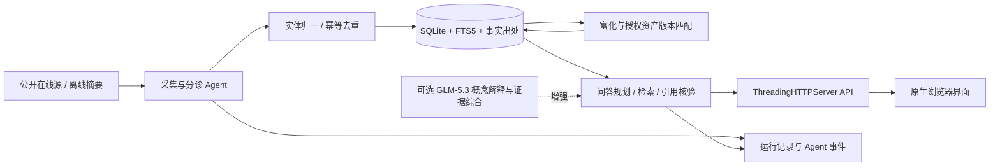

# 知盾 AI 安全知识情报系统

第三届“中国电子杯”赛题 9 的可运行原型：把 AI 安全漏洞公告、研究文章、论文、标准和政策整理到带来源的本地知识库，再以确定性 Agent 工作流完成增量导入、证据抽取、版本匹配和引用式问答。

**当前最可靠的展示方式是离线演示，联网采集曾在真实网络下运行。** 仓库内有 7 条根据公开原始页面人工整理的摘要，覆盖 3 个真实 CVE、同 CVE 的第二来源、论文、标准、政策，以及 3 个明确标注为“演示-虚构”的资产。开发期间记录过 2026-09-28 的一次家庭网络全源采集结果：12 个配置条目中 10 个返回成功，一次任务入库 134 篇文档、90 个漏洞实体、917 条声明（OSV 46、NVD 41、arXiv 论文 19、安全客 8、NIST 标准 7、CISA KEV 6 等）；GitHub Advisory 与 CISA RSS 在该网络下返回 403。**原始批次日志及环境清单尚未随仓库归档，这组数字只是一轮开发观察，不构成可独立复核的持续覆盖或比赛时效成绩。** OSV 可补充部分开源公告，不能据一次运行断言覆盖 GitHub Advisory 的全部内容。

2026-09-29 又完成[两源增量验收](docs/evidence/2026-09-29-在线采集验收.md)和[全源在线开发运行](docs/evidence/2026-09-29-全源在线采集验收.md)，均保存任务、来源原字段及哈希。全源运行读取 465 条、入库 442 篇；12 条配置中 10 条任务成功，GitHub Advisory 与 CISA CERT RSS 返回 HTTP 403。成功的 Hugging Face 博客源没有匹配文档，论文、标准、政策属于知识底座；因此**10/12 不是 7 类漏洞来源的验证结果**。OSV 最终版本处理只跳过被数值区间覆盖的重复枚举，保留区间外与不可解析版本，并补齐 9 条无修复终点的开放区间；证据声明由初始 42,838 条降至 13,378 条。原始逐版本清单仍留在来源记录中。

项目文档：[赛题剖析与设计原则](docs/赛题剖析与设计原则.md) · [10 个开源项目调研](docs/开源项目调研.md) · [5 分钟现场演示脚本](docs/现场演示脚本.md)。本项目借鉴公开项目的架构思想，代码是独立实现，未引入它们的源码。

## 1. 一键启动

在项目根目录执行。需要 Python 3.10 或更新版本；离线演示无需安装 Python 第三方包、无需 API Key、无需外网。

队友首次拉取可直接执行：

```bash
git clone https://github.com/DaiShuHeng/AI_Agent_Security.git
cd AI_Agent_Security
python3 -m app.server --no-scheduler
```

浏览器访问 <http://127.0.0.1:8765>。如需启用 GLM-5.3，复制 `.env.example` 为 `.env.local`，填入各自的 API Key，再执行 `chmod 600 .env.local`；`.env.local` 已被 Git 忽略，禁止提交真实密钥。

```bash
python3 -m app.server --no-scheduler
```

浏览器访问 [http://127.0.0.1:8765](http://127.0.0.1:8765)。首次使用空数据库时，服务会自动导入离线样例；已有数据库不会在启动时重复导入。`--no-scheduler` 关闭定时在线请求，适合现场离线演示。按 `Ctrl+C` 停止服务。

服务默认把 SQLite 数据库放在 `data/zhidun.sqlite3`；可用 `--db` 指定其他路径。若要展示首次导入数量，请使用一个**新的空数据库路径**，例如：

```bash
python3 -m app.server --no-scheduler --db /tmp/zhidun-stage-new.sqlite3
```

若该文件已在先前排练中创建，系统会保留已有数据；再次点击“演示采集”应显示 `skipped` 而不是重新增加 7 条文档。`--no-demo` 可禁止空库自动导入。直接运行 `python3 -m app.server` 会启动定时在线采集器：默认间隔 1800 秒，实际首次在线采集需等待一个间隔或主动点击“在线采集”。

### 命令行与离线评测

```bash
python3 -m app.cli demo
python3 -m app.cli stats
python3 -m app.cli ask 'CVE-2024-37032 的修复版本和本地受影响资产是什么？'
python3 scripts/evaluate.py
python3 -m unittest discover -s tests -v
```

CLI 的 `--db PATH` 位于子命令之前，可针对另一数据库运行，例如 `python3 -m app.cli --db /tmp/zhidun-cli.sqlite3 demo`。在线单源采集命令是 `python3 -m app.cli collect --source github_advisories`，只有在网络与相应外部服务可用时才运行。`scripts/evaluate.py --json` 可输出机器可读结果。

离线评测会临时建库，不修改常用数据库。它检查 7 条样例首导与原样重放跳过、3 个 CVE 实体、同 CVE 两份来源、3 个虚构资产版本匹配、快照时间差统计管道，以及 9 道固定问题（基础 5、同 CVE 双源/关联 3、拒答 1）；输出样本量、**预设规则通过率**、必需引用存在率、事实同行引用标记率、进程内 p50/p95 响应时间等。规则与样例同源，**不能作为官方问答准确率、富化精确率/召回率、多跳泛化或线上时效证明**。

### Docker Compose

在已安装 Docker Engine 和 Compose 的机器上：

```bash
docker compose up --build -d
docker compose logs -f zhidun
docker compose down
```

Compose 将主机端口限制在 `127.0.0.1:8765`，数据库放入命名卷；容器以非 root 用户运行，并设有 `/api/health` 健康检查。当前 `compose.yaml` 仅显式设置 `COLLECT_INTERVAL_SECONDS`；如需把 `NVD_API_KEY`、`GITHUB_TOKEN` 或模型凭据传入容器，应在个人部署覆盖配置中添加环境变量，勿将密钥写入仓库。本工作环境未安装 `docker` 命令，容器构建与运行尚未在这里实测。

## 2. 当前实现了什么

| 环节 | 已实现的可检查行为 | 边界 |
| --- | --- | --- |
| 监测 | `config/sources.json` 配置 NVD、GitHub Advisory、OSV.dev、CISA KEV、RSS、单页 HTML 等连接器；统一记录格式；定时或手动触发、增量游标、重试、日志与运行事件；文档级双时间戳 + demo/live 采集模式标记，`collection_latency_stats` 输出 P50/P95 延迟并经 `/api/dashboard`、`/metrics` 暴露 | 配置 12 个在线来源条目；2026-09-29 一次全源运行已归档：10 条任务成功、2 条 HTTP 403、442 篇入库。成功条目数不等于独立漏洞来源类别；轮询不是流式实时，长期成功率仍未测 |
| 情报归一 | 提取 CVE/GHSA 标识、AI 相关性过滤、同源幂等更新、同 CVE 跨文档归一、SQLite/FTS5 索引 | 多源公告有分歧时保留不同来源，未实现完整的人工裁决流程 |
| 富化 | 将来源已给出的产品、版本、修复版本、CVSS、参考链接抽成有出处的声明（claims 带来源文档外键、摘要片段和来源分层置信度）；OSV 公告只带 CVSS 向量时按 FIRST 规范计算基础分；在线采集后可查询 FIRST EPSS 利用可能性；建立同 CVE、显式提及和产品重合等规则关系；按本地登记资产的版本范围做保守匹配；缺 CVSS 时标“待评估” | 声明的证据片段当前通常取文档摘要，并非逐字段原文定位；离线 7 条样例没有 PoC 链接，在线自动标出的 PoC 链接也只是线索而非可用性验证。不主动扫描互联网资产、不执行 PoC；5 维深度富化及准确率/召回率未做独立真值评测 |
| 问答 | 基于 CVE/产品定位、意图词、FTS5 检索与有限规则关系路径生成带原文 URL 的回答；FTS 未命中时对中文按 CJK 连续段做子串回退检索；盘点类问题（“有哪些高危漏洞”）先按问题主题（AI 推理框架/智能体框架/模型仓库/MLOps 供应链等家族）在 SQL 层过滤受影响产品，再输出“总数-产品分布-代表条目-覆盖说明”的分析师式简报，登记资产结论聚合为一段且只在问题本身涉及资产时给出；答案内嵌 [n] 引用标记，`trace` 展示已走过的关系；只在指代式追问（“它/该/接着说”）时继承上一轮实体；知识不足时拒答 | 当前只验证了少量基础题、同一 CVE 双来源、同产品关联和一条会话追问；`trace` 不自动证明跨独立文档多跳语义推理或答案语义准确率 |
| Agent | 监测、分诊、富化、关联推理、索引、问答规划、核验、自愈等 10 类角色的每步决策记入事件轨迹；工具调用和失败重试可查 | 当前是确定性、可审计的角色编排，不应把它描述成已验证的自主多 Agent 创新架构 |
| Agent 自安全 | 对照 OWASP Agentic AI 安全建议的六攻击面自检（推理劫持隔离/会话记忆隔离/工具与外链协议白名单/最小权限/拒答监督/多智能体审计）：对抗样例注入临时库实测，6/6 通过，`/api/security-selfcheck` 与“运行与轨迹”页可复现，`tests/test_agent_security.py` 可回归 | 自检是项目自定攻击面映射与口径，非 OWASP 官方认证 |
| 可选模型 | GLM-5.3 可解释稳定概念、承接概念追问、规划检索、排序候选并综合公开证据；证据分析附可核验原文锚点，保留结构化核对结果；失败回退本地。返回实际模型角色与知识依据 | 概念解释属于模型通识，不代表实时核验；综合分析检查引用、原文和编号/数值，但不构成语义正确性的证明。用户问题与公开证据发送云端，登记资产不作为综合输入。独立质量与响应指标仍待评测 |
| 界面/运维 | 原生 HTML/CSS/JS 页面（漏洞详情含情报时间线、逐条声明的来源置信度条、自动关联知识与关联理由）、HTTP API、运行日志、`/metrics` 文本指标（计数 + 采集延迟分桶）、Dockerfile/Compose 与单元测试 | 本地原型无登录授权；不要把服务直接暴露到公网；尚无完整 DevOps 与自动运维实测 |

### 架构



后端与 Web UI 均在仓库内，核心模块分别位于 `app/connectors.py`、`app/pipeline.py`、`app/intelligence.py`、`app/db.py`、`app/qa.py`、`app/server.py`；静态界面位于 `web/`。来源文档和抽取事实分别保存，问答的 `citations` 返回文档标题、URL、来源 ID 和发布时间。公开网页是**不可信证据输入**，不被当作 Agent 指令。

## 3. 可核验的离线数据

`data/demo_records.json` 是**人工撰写摘要**，不是原站全文副本、当前实时快照或批量抓取结果。典型出处如下：

- [Ollama CVE-2024-37032 的 GitHub 公告](https://github.com/advisories/GHSA-8hqg-whrw-pv92)与 [Wiz Research 独立分析](https://www.wiz.io/blog/probllama-ollama-vulnerability-cve-2024-37032)：系统将两个文档归到同一 CVE，同时保留来源措辞和部署条件。
- [llama-cpp-python CVE-2024-34359 上游公告](https://github.com/abetlen/llama-cpp-python/security/advisories/GHSA-56xg-wfcc-g829)；[Langflow CVE-2025-3248 上游公告](https://github.com/langflow-ai/langflow/security/advisories/GHSA-rvqx-wpfh-mfx7)。
- [AgentDojo 论文](https://arxiv.org/abs/2406.13352)、[ISO/IEC 42001:2023 官方介绍](https://www.iso.org/standard/42001)、[《生成式人工智能服务管理暂行办法》官方文本](https://www.cac.gov.cn/2023-07/13/c_1690898327029107.htm)。ISO 标准只收录公开介绍页摘要，未复制付费全文。

`data/demo_assets.json` 中的名称以“演示-虚构-”开头，没有真实 IP 或域名。所谓 `internet`、`internal`、`isolated` 是**虚构清单字段**，仅演示版本规则与优先级，不代表系统扫描过真实互联网资产。资产影响判断是版本匹配推断，仍需运维人员核验部署条件。

## 4. 在线来源与配置

编辑 `config/sources.json` 中每个来源的 `id`、`type`、`category`、`url`、`enabled`、`keywords`。当前连接器类型为 `nvd`、`github_advisories`、`osv`（免 key 查询 OSV.dev 的 AI 软件包公告，并按 CVSS 向量计算基础分）、`cisa_kev`、`rss`、`static_html`。应用只对配置中的公共 HTTPS 源发起有界只读请求；NVD/GitHub 可选环境变量 `NVD_API_KEY`、`GITHUB_TOKEN`，未设置时受公开服务限制（GitHub 未带 token 可能 403，OSV 源可覆盖同等公告数据）；FIRST EPSS 利用可能性查询无需 key。

```bash
python3 -m app.cli collect --source github_advisories
python3 -m app.cli stats
```

启动服务后也可在页面点击“在线采集”，或调用 `POST /api/collect` 传入 `{"mode":"live","source_id":"github_advisories"}`；接口返回 `queued` 只表示后台任务已启动，应到“运行与轨迹”确认最终状态和错误。调度间隔可设为 `COLLECT_INTERVAL_SECONDS` 或 `--interval`，实际最短 300 秒。

**12 个配置条目中，9 个是漏洞监测候选源，3 个是论文、标准、政策知识底座源。** 2026-09-28 的 10/12 观察未归档原始日志；2026-09-29 新的全源运行虽已有[归档](docs/evidence/2026-09-29-全源在线采集验收.md)，但仅一次短时手动采集，且其中一条成功源没有匹配内容、三条属于知识底座、两条返回 403，仍未证明赛题的“7 类且实时”；GitHub 与 OSV 也有公告重叠。厂商博客、社区 RSS、CERT RSS 等是否形成有效独立漏洞类别，需按入库内容和持续可用性逐类复核。数据源状态区分配置、演示摘要与在线任务；“≤6 小时”时效档仍需带精确发布时间的真实在线轮询结果单独验证。外部源可能改变格式、拒绝访问、限流或短时不可用。若在线环境的 Python 缺少系统 OpenSSL 根证书，可安装 `certifi` 提供经验证的 CA bundle；程序不会关闭 TLS 验证。

## 5. 可选智谱 GLM-5.3 问答增强

在项目根目录自行建立仅当前用户可读写的 `.env.local`，填入 `ZHIPU_API_KEY=<你的密钥>`；若使用智谱 Coding Plan 密钥，还要填入 `ZHIPU_BASE_URL=https://open.bigmodel.cn/api/coding/paas/v4`。执行 `chmod 600 .env.local`。该文件已列入忽略规则；**不要把真实密钥写进 README、报告、截图、PPT、提交包或 Git**。也可在进程环境中设置同名变量，环境变量优先。启动服务或使用 CLI `ask` 时自动加载本地文件。

默认模型为 `glm-5.3`。代码默认的**标准按量端点**是 `https://open.bigmodel.cn/api/paas/v4`，当前 Coding Plan 密钥应按上文覆盖为 `https://open.bigmodel.cn/api/coding/paas/v4`；程序会追加 `/chat/completions`。`ZHIPU_MODEL` 和 `GLM_TIMEOUT_SECONDS` 可覆盖，超时默认 25 秒。模型 API 地址只允许 HTTPS 或本机 HTTP。项目仍兼容 `LLM_BASE_URL`、`LLM_MODEL`、`LLM_API_KEY` 形式的 OpenAI 兼容端点；配置了 `ZHIPU_API_KEY` 时优先使用智谱配置。

启用后，问答分成两条路径。稳定概念（如“AI 安全是什么”“提示词注入怎么防范”）直接调用模型解释，并明确标为通用知识；概念追问携带前一轮概念问答。具体漏洞、版本、最新事件及资产问题必须先走本地检索。公开情报可由模型综合解释，程序核对引用编号、连续原文摘录和编号/数值是否出现在所引证据中；不合格输出最多修正一次，仍失败就保留本地答案。登记资产查询保持本地处理，不向综合模型传送资产清单。

提示词版本为 `2026-09-29-v2`，定义见 `app/prompts.py`；路由见 `app/concepts.py` 与 `app/qa.py`。`model_role` 可包含 `concept_explanation`、`evidence_synthesis`、`planning`、`evidence_ranking`、`evidence_selection`；`answer_basis` 区分通识、证据综合与本地证据。模型生成能力不代表已完成事实正确性认证：原文锚点检查不能证明每个结论均由原文蕴含，仍需人工留出评测。完整设计和限制见 [Agent 问答设计与验证](docs/Agent问答设计与验证.md)。

纯离线现场演示可用以下命令临时压过本地文件中的密钥，并清除旧兼容变量；该操作不会改动 `.env.local`：

```bash
env -u LLM_BASE_URL -u LLM_MODEL -u LLM_API_KEY ZHIPU_API_KEY='' \
  python3 -m app.server --no-scheduler
```

## 6. HTTP API

默认地址为 `http://127.0.0.1:8765`。以下端点与 `app/server.py` 一致；`POST` 接收 JSON 对象，最大 1 MB。

| 方法 | 路径 | 功能 |
| --- | --- | --- |
| GET | `/api/health` | 进程/数据库路径/版本 |
| GET | `/api/dashboard` | 统计、近期文档、来源、采集批次、事件、采集延迟统计（demo/live 分桶 P50/P95/最大值） |
| GET | `/api/documents?query=ollama&kind=vulnerability&limit=20` | 文档检索与类别过滤 |
| GET | `/api/vulnerabilities` | 按 CVE 归并的漏洞卡片 |
| GET | `/api/vulnerabilities/CVE-2024-37032` | 原始文档、结构化事实、虚构/授权资产匹配、自动关联的知识文档（`related`，标注关联理由） |
| GET | `/api/sources`、`/api/runs`、`/api/assets` | 来源状态、运行事件、资产清单 |
| GET | `/api/security-selfcheck` | Agentic AI 六攻击面自安全自检（临时库对抗测试，返回逐项结果与证据） |
| GET | `/metrics` | Prometheus 文本指标：文档/漏洞/声明计数 + `zhidun_collect_latency_hours{scope,stat}` 延迟分桶 |
| POST | `/api/ask` | `{"question":"CVE-2024-37032 如何修复？","session_id":null}`；返回答案、出处、推理链 trace、拒答标记 |
| POST | `/api/collect` | `{"mode":"demo"}` 同步导入；`{"mode":"live","source_id":"github_advisories"}` 后台联网采集 |
| POST | `/api/assets` | 登记授权资产，字段为 `name`、`product`、`version`、`exposure`、`criticality`、`owner` |

例如：

```bash
curl -s http://127.0.0.1:8765/api/health
curl -s -X POST http://127.0.0.1:8765/api/ask \
  -H 'Content-Type: application/json' \
  -d '{"question":"CVE-2024-37032 的修复版本和本地受影响资产是什么？"}'
```

## 7. 赛题差距与下一步验收

初赛提交材料初稿位于 [交付物/](交付物/)：技术报告（Word + PDF，35 页，含架构图/流程图/代码说明/实测分析）与技术讲解 PPT（14 页，另附 PDF 版）。报告与 PPT 的生成源文件在 `docs/report_assets/`（`content.json`、`generate.js`、`gen_ppt.js`）。修改源内容后，在 `docs/report_assets/` 安装 `npm install` 与 `python3 -m pip install -r requirements-build.txt`，用 `python3 build_all.py` 重建并同步四份交付物；该脚本需要可用的捆绑版 LibreOffice，非默认环境可通过 `BUNDLED_SOFFICE` 指向可信的 `soffice` 绝对路径。操作演示视频需现场录制，可按[现场演示脚本](docs/现场演示脚本.md)执行。详细的批判性检查与整改记录见[系统审计与整改记录](docs/系统审计与整改记录.md)。

如需提交源码供审阅，在项目根目录运行 `python3 scripts/package_submission.py`，使用 `交付物/知盾AI赛题9_源码审阅包.zip`。打包器采用公开文件白名单，排除本地 `.env.local`、数据库、缓存、依赖目录和重复生成的报告文件。**不要直接压缩整个工作目录**，其中可能有个人密钥；提交前再次检查压缩包清单。

目前能严谨声称的是“小型公开样例的离线闭环、来源链接、虚构资产版本匹配、三种规则关系（同 CVE 归并 / 显式提及 / 产品重合）、同一 CVE 双源关联与有限会话追问、原样重放跳过、时间差统计管道”，以及 2026-09-28 的**一次未归档原始运行记录的联网观察**（10/12 配置条目成功、134 篇入库）和 2026-09-29 **有归档的全源短时开发运行**（10 条任务成功、442 篇入库，范围与失败详见证据文件）。`scripts/evaluate.py` 的通过率来自**人工固定的 9 道开发规则题**，并非语义准确率或独立留出数据。尚未取得以下官方优秀档证明：

- 真实线上 ≥7 类漏洞监测来源的持续可用性和 ≤6 小时采集延迟；
- ≥5 个**自动**富化维度及富化准确率、召回率均 ≥95% 的人工真值评测；
- 广泛复杂问题的语义理解、多跳推理、可解释性及 ≥95% 问答准确率；
- 实际环境中的高并发、稳定性、完整 DevOps 与自动运维。

原始来源、评测方法、限制及后续验收口径见[赛题剖析与设计原则](docs/赛题剖析与设计原则.md)。系统不主动扫描陌生资产、不执行 PoC；互联网公开情报的引用仅用于防守研究和来源核验。
