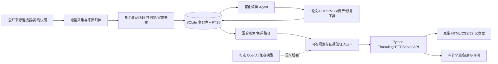

# 赛题 9 剖析与设计原则

> 项目代号：知盾（ZhìDùn）AI 安全情报系统  
> 文档状态：设计基线兼实施审计；下文“代码已实现”仅描述可检查行为，**不代表赛题性能档位已经达标**。  
> 核对日期：2026 年 9 月 29 日。分数与期限以赛事后续正式通知和校内安排为准。

## 1. 原始依据与引用方式

| 代号 | 本目录中的原始文件 | 主要依据 |
| --- | --- | --- |
| S9 | `../../9 赛题九：网信产业应用赛道-智能体驱动的AI安全知识情报系统设计与实现（奇安信科技集团股份有限公司）.pdf` | 第 1 页：背景、三大模块、知识底座；第 2–3 页：初赛要求及评分；第 3–4 页：决赛要求及评分、部署说明 |
| N | `../../关于第三届 “中国电子杯” 高校 ICT 产教融合创新大赛报名的通知.pdf` | 第 2 页：参赛与原创要求；第 3–4 页：赛程和晋级规则 |
| A | `../../附件1：第三届“中国电子杯”高校ICT产教融合创新大赛赛道方案.pdf` | 第 1 页：网信产业应用赛道与团队形式 |

以下的 `〔S9，第 x 页〕` 等标记均指上述**完整文件名及 PDF 物理页码**。本项目把赛题原文的“要求/评分”与团队自拟的“实现策略/目标”分开，不把设计目标写成官方硬性规定。

## 2. 赛题核心判断

赛题不是单一的漏洞列表或通用聊天机器人，而是“持续发现 → 可信富化 → 可追溯问答”的 AI 安全知识情报闭环。三大核心能力为：自动监测并汇聚多源 AI 安全漏洞；以论文、受影响资产、POC、CVSS、影响评估等信息进行深度加工；在所得知识库上理解复杂自然语言问题，进行跨文档语义检索和关联推理。论文、技术标准及政策法规的同步采集另构成知识底座。Agent 的角色数和架构未被限定，但任务编排、自主决策和工具调用是明确鼓励方向。〔S9，第 1 页〕

赛题所列“AI 基础设施/推理框架、模型与数据、AI 应用与智能体、供应链”四类风险**只是参考，不是评分依据**。分类体系须解释清楚即可。〔S9，第 2 页〕

### 2.1 官方要求到产品能力的映射

| 编号 | 官方要求或评价点 | 本项目的设计响应 | 可核验的验收证据 | 属性与依据 |
| --- | --- | --- | --- | --- |
| R01 | CVE/NVD、安全社区、厂商公告、博客等多源自动监测，持续发现和汇聚最新 AI 安全漏洞 | 插件式来源连接器、调度任务、增量游标、原始记录归档、规范化与去重 | 连接器清单；带来源、发布时间、首次采集时间的记录；重复输入去重演示 | 核心要求〔S9，第 1 页〕 |
| R02 | 富化论文/分析文章、互联网受影响资产、POC、CVSS、影响评估等维度 | 每个富化字段附来源 URL、检索时间、证据片段、关联理由和置信状态 | 单个漏洞的五维证据卡；错误关联的拒绝样例；人工标注评测 | 核心要求〔S9，第 1–3 页〕 |
| R03 | 自然语言问答、复杂查询理解、跨文档语义检索与关联推理 | 检索规划器、实体消歧、证据聚合、关系路径、带出处的答案与“不足以判断”分支 | 影响范围/修复/攻击链问题集；跨两份以上文档的证据链；多轮上下文演示 | 核心要求〔S9，第 1–4 页〕 |
| R04 | 同步采集 AI 安全论文、技术标准与政策法规 | 将三类知识文档与漏洞情报分开建模，同时统一检索和引用 | 三类样本各自的来源、日期、版本及检索结果 | 核心要求〔S9，第 1 页〕 |
| R05 | Agent 自主决策、任务编排、工具调用；评价多角色协作与可扩展性 | 使用可审计的计划、执行、验证角色与工具契约，保留每一步决策日志；LLM 为可选增强 | 同一任务的决策轨迹、工具调用、失败回退、关闭 Agent 的消融对比 | 高分目标〔S9，第 2–4 页〕 |
| R06 | 从采集到问答自动化，异常处理、自愈与工程化 | 定时触发、幂等重试、错误隔离、健康检查、状态仪表盘、部署脚本和回滚方案 | 断网/来源错误/坏数据注入后的恢复记录；启动与部署复现 | 高分目标〔S9，第 3–4 页〕 |
| R07 | 技术报告、视频、PPT 和现场答辩 | 项目文档、评测脚本、可重复演示剧本、去身份化决赛材料 | 清单逐件检查、报告数据可回溯至测试输出 | 提交要求〔S9，第 2–4 页〕 |

“互联网受影响资产”可通过**有授权的资产清单或合法的被动公开数据**关联；不把未经授权的互联网扫描、漏洞利用或 POC 执行设为功能前提。此为团队安全设计原则，非赛题对实现手段的指定。

## 3. 评分拆解与冲奖目标

### 3.1 校内初赛：100 分

| 指标 | 分值 | 合格/良好/优秀原文门槛的准确转述 | 本项目优先级 | 依据 |
| --- | ---: | --- | --- | --- |
| 情报监测完整性 | 15 | 至少 3 类数据源 9 分；至少 5 类 12 分；至少 7 类且含实时监测 15 分 | P0：按**类别**列明、逐源证明，不以 7 个网址冒充 7 类 | 〔S9，第 2 页〕 |
| 情报富化完整性 | 15 | 至少 3 种富化维度 9 分；至少 5 种 12 分；准确且含自动关联推理 15 分 | P0：五维以上且证据可追溯 | 〔S9，第 2–3 页〕 |
| 情报问答完整性 | 15 | 关键词问答 9 分；语义理解及多轮 12 分；跨文档推理及深度分析 15 分 | P0：不能把关键词命中包装为深度推理 | 〔S9，第 3 页〕 |
| 监测时效性 | 5 | 发布到采集延迟 ≤24/12/6 小时对应 3/4/5 分 | P1：留双时间戳和分布图 | 〔S9，第 3 页〕 |
| 富化准确率 | 5 | ≥70%/85%/95% 对应 3/4/5 分 | P0：人工真值集与计算脚本 | 〔S9，第 3 页〕 |
| 问答深度与准确率 | 5 | 基础问答准确率 ≥70% 为 3 分；深度问答含推理链为 4 分；多跳推理准确率 ≥85% 为 5 分 | P0：复杂问题真值与证据链 | 〔S9，第 3 页〕 |
| 智能体架构设计 | 15 | 基本 Agent 框架 9 分；多角色协作与自主编排 12 分；精良且可扩展 15 分 | P0：可视化轨迹、契约、消融 | 〔S9，第 3 页〕 |
| 系统自动化程度 | 10 | 核心流程自动化 6 分；全流程且异常处理 8 分；全流程加自愈 10 分 | P1：可观察失败与恢复 | 〔S9，第 3 页〕 |
| 文档质量 | 15 | 完整清晰 9–12 分；详细设计图与流程图、逻辑严谨 12–15 分 | P0：图与代码、测试数据一致 | 〔S9，第 3 页〕 |

赛题概述提到“演示效果”，但初赛的 100 分量化表没有为其单列分值；仍须按提交要求准备操作视频。〔S9，第 2–3 页〕

### 3.2 线下决赛：100 分

| 指标 | 分值 | 合格/良好/优秀原文门槛的准确转述 | 依据 |
| --- | ---: | --- | --- |
| 情报监测完整性 | 10 | 多源自动采集 6；广覆盖及增量监测 8；全自动、实时、去重 10 | 〔S9，第 3 页〕 |
| 情报富化完整性 | 10 | 基本维度 6；多维自动富化 8；精准富化、智能关联 10 | 〔S9，第 3 页〕 |
| 情报问答完整性 | 10 | 语义问答 6；多轮及推理 8；深度推理及个性化推荐 10 | 〔S9，第 3 页〕 |
| 监测时效性与稳定性 | 5 | 延迟 ≤24/12/6 小时对应 3/4/5 分 | 〔S9，第 3–4 页〕 |
| 富化准确率与召回率 | 5 | 准确率 ≥80% 且召回率 ≥70% 为 3；两者均 ≥90% 为 4；均 ≥95% 为 5 | 〔S9，第 4 页〕 |
| 问答质量 | 10 | 准确率 ≥75% 且响应 ≤5 秒为 6；准确率 ≥90% 且支持多跳推理为 8；准确率 ≥95% 且推理链可解释为 10 | 〔S9，第 4 页〕 |
| 智能体运用水平 | 15 | 有效运用 Agent 9；多 Agent 协作编排 12；架构创新且效果显著 15 | 〔S9，第 4 页〕 |
| 系统自动化与工程化 | 10 | 基本可部署 6；容器化部署及日志监控 8；完整 DevOps 及自动运维 10 | 〔S9，第 4 页〕 |
| 技术文档 | 10 | 完整规范 6–8；精良且可作技术参考 8–10 | 〔S9，第 4 页〕 |
| 答辩表现 | 10 | 清晰陈述、基础问答 6–8；逻辑严密、技术理解深入、回答精准 8–10 | 〔S9，第 4 页〕 |
| 其他 | 5 | 创新性、系统性、实用性、团队协作，由评委综合主观评分 | 〔S9，第 4 页〕 |

**冲奖重点**：初赛三大功能与 Agent 合计 60 分，决赛三大功能与 Agent 合计 45 分；真实的高质量能力比 UI 装饰更重要。决赛还把富化召回率、问答响应、部署运维和答辩显式纳入评分。分值占比是优先级参考，不构成“达到某数字必得奖”的承诺。〔S9，第 2–4 页〕

## 4. 设计原则

1. **证据先于结论**：一切漏洞、受影响版本、CVSS、POC、修复建议和推理结论都能回溯到原始页面、文档版本、片段及抓取时间。来源冲突时显示冲突，不让模型自行裁决成确定事实。
2. **事实、推断、建议分层**：数据字段明确标为“来源原文”“规则归一化”“系统推断”“人工确认”；不把厂商未确认的信息说成事实。
3. **增量与时间语义正确**：区分漏洞发现、来源发布、来源更新、首次采集、富化完成时间。保留历史修订，不用最新时间覆盖早期值。
4. **可复现优先**：内置来源明确的公开情报离线快照和固定测试集，断网、无 API Key、无付费模型也可运行核心演示；在线连接器与可选 OpenAI 兼容模型用于增强，但结果需另行实测。
5. **最小依赖、可审计 Agent**：Python 标准库后端、SQLite/FTS5、原生 HTML/CSS/JS；确定性编排先保证基础功能可复现，再以模型做受控的语义扩展。多 Agent 不是多个提示词名称，必须有职责、输入输出契约、决策点、工具轨迹和错误恢复。
6. **指标诚实**：只有评测脚本、数据集版本、样本量、环境与原始结果齐全，才在报告中声明准确率、召回率、延迟或响应时间。离线快照不能证明真实线上监测时效；模拟数据不能伪装成实时采集。
7. **安全边界内的情报研究**：收集和索引 POC 元数据及公开链接，不自动执行攻击代码；资产关联仅面向授权资产清单或合规被动数据。尊重来源许可、服务条款、限流与隐私要求。
8. **优雅降级**：单个源失败、无网络、模型不可用或原文内容恶意时，保留可用的本地检索与有出处的答案，并明确缺失范围。

## 5. 拟议技术架构

以下是**拟议架构**，不是已完成清单。实现与评测证据应由后续代码和测试文档逐项回填。

### 5.1 模块和最小数据契约

| 模块 | 输入 | 输出与约束 |
| --- | --- | --- |
| `source adapters` | 公开订阅源、公开 API、许可的公告页面或离线快照 | 原始 ID/URL、标题、正文、发布/更新时间、抓取时间、许可/来源标识；支持增量游标和去重键 |
| `normalizer` | 来源记录 | 统一的漏洞实体、别名、AI 相关性理由、产品与版本、风险类别；原文不丢失 |
| `enrichment` | 漏洞实体和可用工具 | 论文/分析、资产、POC、CVSS、影响、修复等独立记录；每条保留证据和“未确认”状态 |
| `knowledge store` | 漏洞情报、论文、标准、政策、关系 | SQLite 结构化表与 FTS5 全文索引；关系边含依据、创建时间、更新状态 |
| `agent orchestrator` | 定时任务或用户问题 | 选择工具、设置预算、规划步骤、校验证据、失败重试；输出可读轨迹 |
| `QA` | 自然语言问题、上下文、检索候选 | 带文档引用的答案/证据路径；回答不了时说明缺少何种信息，不编造 |
| `HTTP + UI` | 浏览器请求 | 搜索、漏洞详情、来源与关系图、任务运行状态、问答、评测证据展示 |

**Python 标准库 `ThreadingHTTPServer` 适合作为便携竞赛原型的本地服务入口；公开互联网部署前还需补齐认证、反向代理、限流、TLS 等生产边界。** 离线版的 FTS5 加实体词典可提供可复现的文本检索与规则推理；“语义问答”的高分门槛须通过真实语义检索/模型增强及独立测试证明，不能仅凭同义词替换宣称达到。〔S9，第 3–4 页〕

### 5.2 Agent 的可审计协作

建议将单次任务表达为 `目标 → 计划 → 工具选择 → 结果校验 → 继续/停止/人工复核`。监测 Agent 决定需要更新的来源；富化 Agent 决定缺失维度与检索工具；问答 Agent 决定实体消歧、证据查找和多跳路径；验证 Agent 检查时间、来源可靠度与引用完整性。每个角色必须记录输入、工具、输出、错误与耗时。多角色协作的价值应通过消融实验（如关闭跨文档路径或富化 Agent）呈现，而不是只展示流程图。〔S9，第 1、3–4 页〕

模型产生的文字仅为**候选推断**；数据库证据、确定性校验和人工标注评测决定可发布的结论。网页和 POC 文本作为不可信数据处理，绝不成为对 Agent 的系统指令。

## 6. 来源覆盖策略与不确定项

初赛优秀档写的是“至少 7 **类**数据源且含实时监测”，并未列出七类的官方分类法。计划把来源类型公开成配置表并在报告中逐类说明：①官方漏洞库，②开源软件安全公告库，③厂商安全公告，④CERT/CSIRT 公告，⑤政府已利用漏洞目录，⑥安全研究社区，⑦技术博客/研究团队公告。论文、标准、政策作为知识底座另列，不擅自把三类文档计入“漏洞监测的 7 类”。这些是**目标类别，只有相应连接器通过验收后才算已覆盖**。〔S9，第 1–2 页〕

赛题未定义“实时”的最长轮询间隔、“来源类”的归类口径、富化准确率与召回率的标注规则、问答准确率的评分样本、Agent 创新的客观判据、标准运行环境、模型/商业 API 必要性。项目应在评测方案中自定并公开这些口径，保留评委复核空间；不得用自定义口径冒充官方定义。〔S9，第 2–4 页〕

## 7. 指标与验收证据

| 指标 | 建议计算口径与证据 | 容易误报的点 |
| --- | --- | --- |
| 监测延迟 | 团队代理口径：`首次成功采集时间 - 来源首次公开发布时间`；报告样本量、时区、P50/P95/最大值、成功率；只有含时分秒且可核验的**在线**记录可用于小时档判定 | 离线摘要大多只有日期，程序按零点计算的小时差只验证统计管道；决赛“发现”起点与“发布”起点未必相同，应分别说明，不能拿离线或来源更新时间冲抵 |
| 富化准确率 | 团队建议的事实级精确率代理：人工标注“实体–富化事实”对，`TP/(TP+FP)`；报告抽样方法、分维度结果和标注分歧。赛题未给出此指标的标注单位或计算公式 | 仅计算成功富化的高置信样本会抬高数值；从来源原字段搬运的 5 种字段不自动等于 5 种深度富化能力 |
| 富化召回率 | 在可评测的真值关系全集上 `TP/(TP+FN)`；报告漏检列表 | 无真值全集或只拿系统输出作真值时不能声称召回率 |
| 问答准确率 | 冻结问题集，含事实题、跨文档题、多跳题、无法回答题；逐题判定事实、时效、出处是否正确 | 只展示精选示例、只看语句流畅度、遗漏拒答题 |
| 多跳推理 | 最少两条独立、有出处的关系边形成的可检查路径；记录路径和原文证据 | 多段文本拼接不等于跨文档推理 |
| 问答响应 | 记录从 HTTP 请求进入到完整回答返回的墙钟时间，披露本地硬件、缓存、模型供应商和 P50/P95 | `scripts/evaluate.py` 仅量本地进程内 `AnswerEngine.ask`；9 道固定题的毫秒数不能与决赛 ≤5 秒档直接比较 |
| 自动化/自愈 | 预设来源超时、重复记录、错误字段、数据库占用、模型失败场景，记录失败检测、重试、告警、恢复 | 手工重启不应称为自动自愈 |

赛题优秀档的 ≥95% 等数值是**评审门槛，不是本项目现有测试结果**。测试集应由真实公开案例构成，冻结版本并分离开发集与留出集；人工双人复核争议样本，禁止为了冲分临时删除失败样本。〔S9，第 3–4 页；N，第 2–3 页〕

当前 `data/eval_gold.json` 与 `data/demo_records.json` 同源，固定规则包括验收词、来源 ID、URL、事实同行引用标记与少量关系路径。脚本输出的是**开发规则通过率**、必需引用存在率、同一行标记率和进程内耗时；它没有独立判定答案语义真伪、来源是否真正支撑每个断言，也没有测量富化精确率/召回率、在线延迟或通用多跳准确率。三道双源/关联题围绕同一 Ollama 案例，不构成跨案例泛化证明。

## 8. 安全、合法与科研诚信

- 参赛材料须原创、无侵权、无虚假；抄袭、盗用或虚假材料会导致失去参赛资格等后果。引用开源项目时保留许可证和来源；公开快照保留原网址、抓取日期和可再分发许可，不整包复制受限数据库。〔N，第 2–3 页〕
- 不执行 POC，不调用攻击脚本；展示 POC 的可用性只基于公开仓库元数据、人工审查和受控环境记录。漏洞细节避免提供对未授权目标的操作性利用流程。
- 资产定位只处理团队授权的资产清单或合法被动情报；不扫描、探测或尝试利用陌生互联网资产。对 IP、域名、联系人和用户数据实行最小化保存及访问控制。
- 连接器遵守来源协议、授权、限速和删除请求；密钥放环境变量，日志脱敏，拒绝把密钥、个人信息或完整敏感页面送往模型服务。
- 所有外部文档、搜索结果和 POC README 视为不可信输入；阻止提示词注入、SSRF、路径穿越、SQL 注入、跨站脚本、恶意重定向和高成本查询。模型不能自行放宽工具权限。
- 风险判断应保留时间和不确定性：未验证的受影响版本、未证实的利用状态、相互矛盾的 CVSS 应明确标注。

## 9. 离线复现与演示设计

离线演示应在无网络、无商业账户、无模型 Key 的环境中用 7 条**人工撰写的公开来源摘要**完成“导入 → 去重 → 富化 → 检索 → 问答 → 证据链”闭环，并显示原始来源 URL 和人工核验日期。它们不是原站完整快照或自动抓取记录。在线连接器则作为独立演示路线，明确外部站点、网络、限流和 API 权限对结果的影响。可选模型开启前后如要声称效果提升，应另行报告独立评测的准确率、覆盖率、耗时与成本。功能界面须清楚区分“演示摘要”“在线连接器”和故障样例。

建议现场剧本：①从某公开公告触发增量采集并展示重复消息合并；②选定一个 AI 框架漏洞，展开至少五维证据与冲突说明；③提问“哪些版本受影响、依据是什么、怎么修复”并追溯公告；④跨漏洞/论文/标准追问，展示两跳关系；⑤模拟一个连接器超时，展示错误、重试及降级。**剧本中的每个成功步骤以实际运行结果为准，不预先录制虚假数据。**〔S9，第 1–4 页；N，第 2–3 页〕

## 10. 交付物与赛程

### 10.1 校内初赛

- 技术报告：Word 与 PDF 各一份。建议封面或目录后第 1–2 页为核心亮点预览。报告须覆盖总体架构、Agent 方案、监测/富化/问答详细设计、技术选型、工作流程图、实现细节、核心代码说明、功能效果、性能测试分析、创新点。〔S9，第 2 页〕
- 操作演示视频。〔S9，第 2 页〕
- 技术讲解 PPT **以 PDF 格式提交**。〔S9，第 2 页〕
- 题目称源码由企业在参赛平台审阅，不单独提交；又称主办方不提供统一参赛平台。应保留可审阅仓库、运行说明和版本号，并向校方确认实际审阅入口，不能自行假设。〔S9，第 2、4 页〕

### 10.2 线下决赛

- 答辩 PPT：凝练方案、亮点、创新点与相较现有方案的优势；**不得出现队伍单位、人名等识别信息**，模板由主办方提供。〔S9，第 3 页〕
- 技术报告 Word 与 PDF 各一份，完整介绍最终方案；另交操作演示视频。〔S9，第 3 页〕

### 10.3 已公布日期与团队要求

| 时间 | 事项 | 依据 |
| --- | --- | --- |
| 2026-10-15 24:00 | 大赛报名截止 | 〔N，第 3 页〕 |
| 2026-10-25 前 | 各高校自行组织校内初赛；学校可能另设更早内部期限 | 〔N，第 3 页；S9，第 2 页〕 |
| 2026-10-30 前 | 校方报送最终入选项目名单 | 〔N，第 3 页〕 |
| 2026-11-20 前 | 晋级队伍决赛材料以学校为单位提交 | 〔N，第 3–4 页〕 |
| 2026-12-03 | 现场决赛 | 〔N，第 3 页〕 |

每队 3 名实际核心成员，指导老师不超过 2 名；网信产业应用赛道每校每赛题原则上推荐 1 支队伍晋级决赛，命题企业另有优秀团队推荐机制。作品须是团队自有知识产权的真实系统和材料。〔N，第 2–3 页；A，第 1 页〕

通知有“初赛、决赛均由组委会统一组织”的概括性表述，但同通知详细赛程和赛题都明确“校内初赛由各校组织”。具体报送方式和校内时间以学校最新通知核实。〔N，第 3–4 页；S9，第 2 页〕

## 11. 功能状态与验收清单

核对日期：2026-09-29。状态与证据随每次合并更新；“部分完成”必须写明缺口。

| 项 | 验收门槛 | 状态 | 证据路径 |
| --- | --- | --- | --- |
| 离线摘要与出处 | 可复现导入、逐条可追溯、确认再分发边界 | 已实现导入；原站全文授权不适用 | `data/demo_records.json`：7 条自行撰写摘要，有原 URL 与人工核验日期；不是原站全文镜像或实时抓取 |
| 多源连接器 | 分类型列明真实可运行来源、增量游标、限流与失败处理 | 代码已实现；评分覆盖未验证 | `config/sources.json` 有 12 个在线配置：9 个监测候选源、3 个知识底座源。[全源短时运行归档](evidence/2026-09-29-全源在线采集验收.md)记录 10 条任务成功、2 条 HTTP 403、442 篇入库；成功源中有无匹配内容的条目，另有 3 条属于知识底座。[CISA/OSV 增量验收](evidence/2026-09-29-在线采集验收.md)验证了幂等和游标。两者都不能证明 7 类独立来源持续实时监测 |
| 规范化去重 | 同一漏洞跨来源合并，保留来源与冲突 | 小样例已验证 | `app/db.py` 同源幂等写入、同 CVE 归并；离线评测验证重复导入 7/7 跳过和两份 Ollama 文档归并；未测未知在线记录的误合并/漏合并率 |
| ≥5 维富化 | 每维独立证据、关联理由、可人工审查 | 部分完成 | `app/intelligence.py` 把来源已有的产品、版本、修复版本、CVSS、参考 URL 等字段写为 claims，在线可加 EPSS、本地清单可做版本匹配；离线样例没有 PoC 链接，在线 PoC URL 识别也只是未核验线索；尚无独立真值证明 5 维深度富化及准确率 |
| 论文/标准/政策底座 | 三类信息可独立采集并参与检索 | 小样例已验证；在线覆盖待测 | `data/demo_records.json` 各 1 条 arXiv/ISO/网信办自行撰写摘要；`config/sources.json` 有对应连接器配置，样本量不能代表广泛覆盖 |
| Agent 编排 | 实际角色协作、工具调用可追踪、失败可回退 | 可审计规则编排已实现；自主性未评测 | `app/pipeline.py` 等以角色名记录事件和重试；角色标签数量不等于独立自主 Agent 数或架构创新得分 |
| 自然语言问答 | 基础、多源、多轮、拒答并有证据 | 小样例规则验收 | `app/qa.py`；9 道开发题包括基础 5、同 CVE 双源/关联 3、拒答 1。词与引用标记通过不等于语义准确率或通用多跳推理 |
| Agentic AI 自安全 | 注入隔离、会话隔离与工具边界等可复核 | 自定样例通过；非外部认证 | `app/security_selfcheck.py`、`tests/test_agent_security.py` 的 6 个本地攻击面案例；不能写成 OWASP 官方认证或全面安全保证 |
| 准确率/召回率评测 | 独立留出题、人工真值、原始结果与错误分析 | 尚未完成竞赛指标评测 | `scripts/evaluate.py` + `data/eval_gold.json` 只做开发规则自测；富化精确率/召回率、问答语义准确率均未获得独立估计 |
| 时效/性能评测 | 可核验的首次发布时间与采集时间、代表性请求耗时 | 统计代码已实现；时效门槛未验证 | 双时间戳、`collection_latency_stats` 和 9 题进程内 P50/P95；离线样例只有日期，无法判定 ≤6 小时或 HTTP/模型响应 ≤5 秒 |
| 部署与监控 | 可启动、健康检查、日志、故障恢复演示 | Python 入口可运行；容器和 CI 需留运行证据 | `python3 -m app.server --no-scheduler`、`/api/health`、`/metrics`、Dockerfile/compose、CI 配置；配置文件存在不等于完整 DevOps 实测 |
| 报告/视频/PPT | 符合初赛和决赛文件格式、匿名要求 | 静态材料已有；视频和匿名复核待做 | `交付物/` 有报告 Word+PDF、讲解 PPT+PDF；演示视频待录制，最终材料应与本表及最新评测输出逐项同步 |

在最终技术报告中，任何未完成条目必须明确列入“限制与后续工作”。真实、完整、可重复验证的系统，比无法核实的高分声明更有竞争力。
